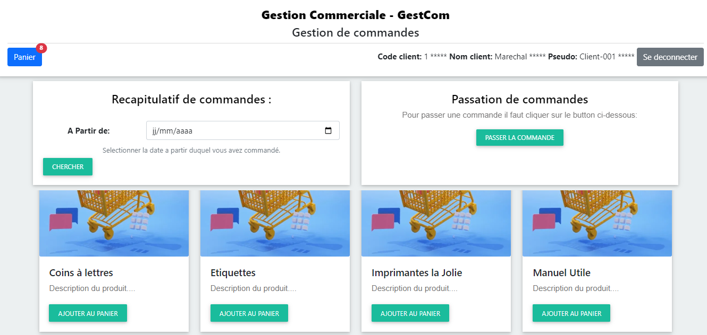
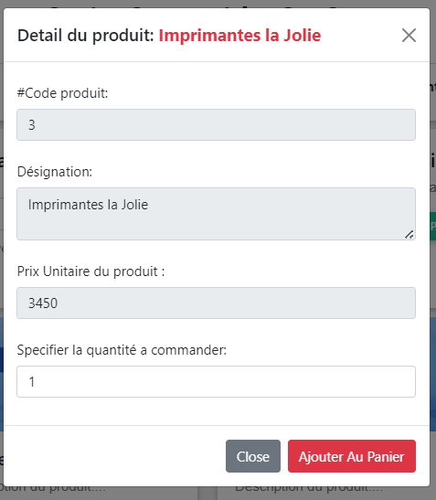
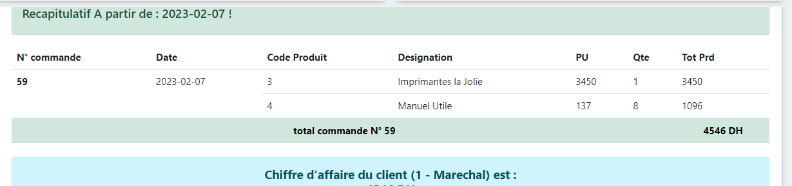
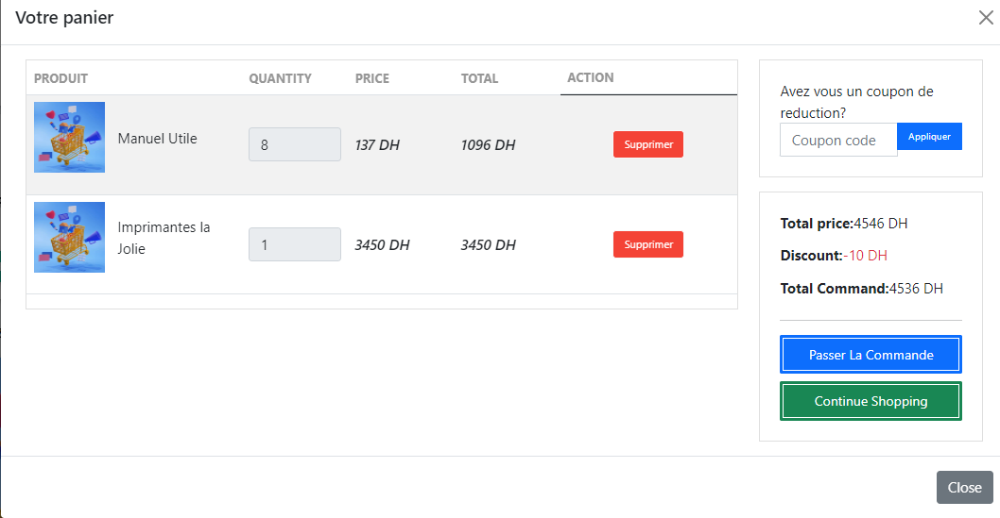

# project idea
the application is a web PHP app that enables the user to manage the cart of an e-commerce website, it allows the user to log in:

after that, the user can either buy an item:

add that item to the cart

they can checkthe command details:

check the cart:

<h3>The app was developed using
PHP, css, html, javascript, bootstrap
Database : Mysql
</h3>

